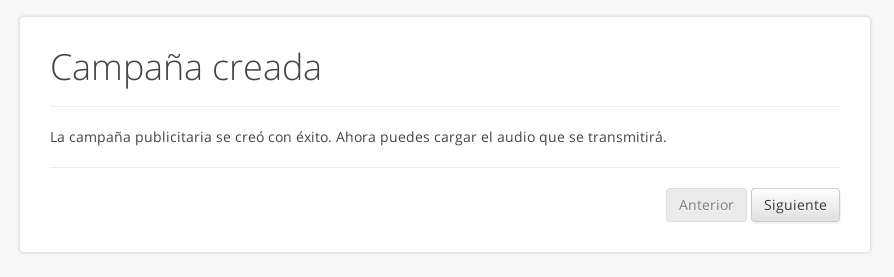
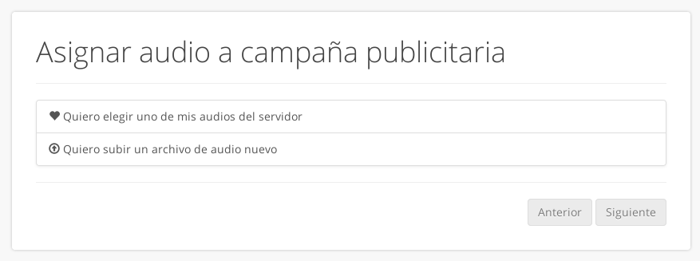
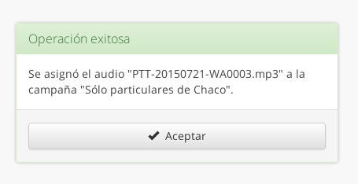

.. _guia:

================
Guía paso a paso
================

Esta guía describe paso a paso cómo crear y configurar una campaña a través de
la interfaz web de la aplicación.  Se asume que la cuenta :ref:`tiene crédito
<resumen-credito>` suficiente para realizar llamadas y completar la campaña.

1. Inicie el asistente para crear la campaña en :menuselection:`Campañas -->
   Crear campaña`.  Se le preguntará de dónde desea obtener los números de
   teléfono a llamar:

    - Si desea usar los números provistos por el sistema, seleccione la opción
      :guilabel:`Buscar en la guía telefónica`.  Siga los pasos de acuerdo a la
      documentación del :ref:`filtrado de números telefónicos <numeros-gt>` para elegir
      específicamente a qué números llamar.

    - Si desea subir su propia lista en formato XLS o CSV, seleccione
      :guilabel:`Subir mi lista en un archivo`.  Tenga en cuenta que el número
      telefónico debe estar en la primer columna para que el sistema pueda
      reconocerlo como tal.

    - Si ya tenía una o más listas personalizadas cargadas en el sistema,
      aparecerá la opción :guilabel:`Usar una de mis listas del servidor`.

.. image:: _static/screen-wiz-numsrc.png
  :align: center

2. Luego de seleccionados los números, el sistema creará la campaña y mostará
   el mensaje de *Campaña creada*.  Pulse el botón :guilabel:`Siguiente`.

3. A continuación deberá elegir la locución de audio que escuchará la gente
   cuando atienda el llamado.  Si ya tenía una locución cargada en el servidor,
   se le dará la opción de elegir alguna o subir una nueva; de lo contrario se
   le pedirá directamente que suba un archivo de audio.

4. Luego de seleccionada la locución de audio aparecerá el mensaje indicando
   que la operación fue exitosa. Pulse el botón :guilabel:`Aceptar` para ser
   dirigido a la :ref:`vista de detalles de la campaña <mod-campa-view>` que
   acaba de crear.

5. Por defecto las campañas nuevas se crean *bloqueadas*, es decir que no
   procesan llamadas sin importar si hay crédito o números disponibles.  Puede
   cambiar las opciones de :ref:`respuestas del oyente
   <resumen-respuestas-del-oyente>` y los días y horarios en los que se
   realizarán las llamadas a través de la :ref:`edición de campaña
   <mod-campa-edit>` al pulsar el botón :guilabel:`Editar` en la barra de
   herramientas.  También puede :ref:`hacer una llamada de prueba
   <mod-campa-test>` para comprobar cómo se escucha su locución en el teléfono.

   Si ya realizó los cambios pertinentes, puede comenzar a realizar llamadas
   desbloqueando la campaña con el botón :guilabel:`Habilitar` en la barra de
   herramientas.

6. A medida que se vayan haciendo las llamadas se irán consumiendo los números
   de teléfono.  La campaña finalizará cuando no queden más números para
   llamar, cuando se acabe el crédito, cuando llegue la fecha de finalización
   de la campaña, o cuando usted la deshabilite a través del botón
   :guilabel:`Bloquear`.

