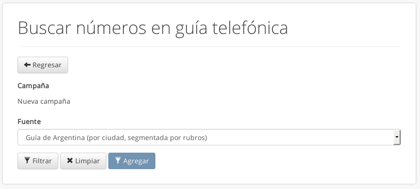
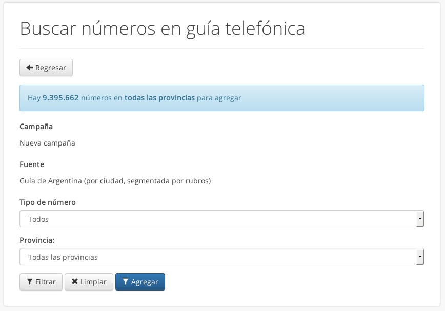
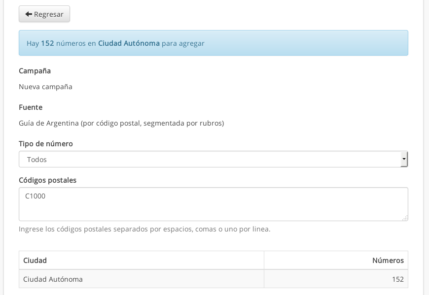
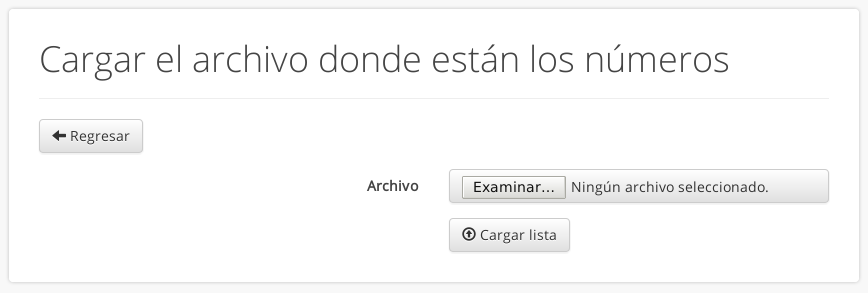
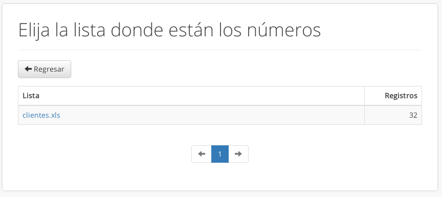
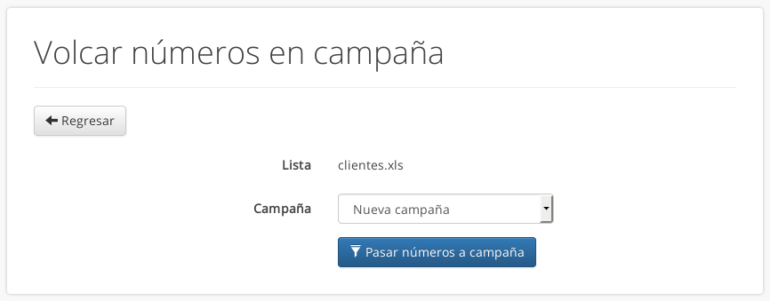

.. _numeros:

===================
Números telefónicos
===================

Cada campaña tiene asociada una lista de números telefónicos a los que llamará.
Hay dos formas de obtener los números: una es a través de una de las guías
telefónicas del sistema, y la otra es mediante una lista de números provista
por el usuario.

Para acceder poder cargar los números en una campaña existen dos métodos:

- Crear una campaña mediante el *asistente para creación de campañas*, con el
  botón :guilabel:`Crear campaña` en la opción :menuselection:`Campañas` del
  menú.

- Si ya tiene una campaña creada y desea agregarle más números, puede
  seleccionar la campaña desde la lista en el menú :menuselection:`Campañas` y
  a continuación elegir :menuselection:`Editar --> Agregar números`.

En ambos casos se le presentarán las opciones de selección y filtrado de
números que se describen a continuación.

.. _numeros-gt:

Usar la guía telefónica del sistema
===================================

Seleccione la opción :guilabel:`Buscar en la guía telefónica` si desea copiar
los números desde una de las guías telefónicas del sistema.  A continuación
deberá elegir cómo filtrar los números.  Seleccione un método de la lista
desplegable :guilabel:`Fuente` y presione el botón :guilabel:`Filtrar` para
continuar con el proceso.

Los métodos disponibles son:

- :ref:`Guía de Argentina (por ciudad, segmentada por rubros) <numeros-gt-ciudad>`

- :ref:`Guía de Argentina (por zona, segmentada por rubros) <numeros-gt-zona>`

- :ref:`Guía de Argentina (por código postal, segmentada por rubros)
  <numeros-gt-cp>`

- :ref:`Guía telefónica de Paraguay <numeros-gt-py>`

.. _numeros-gt-ciudad:

Filtrar por ciudad
------------------

Este método seleccionará los números de toda una provincia, localidad o ciudad.
Opcionalmente le permite elegir sólo los números de un rubro determinado
(particulares, comerciales una categoría específica, etc.).

Seleccione el rubro en la lista desplegable :guilabel:`Tipo de número`, y la
provincia, localidad y ciudad en las listas subsiguientes.  Pulse el botón
:guilabel:`Filtrar` para contar la cantidad de números que se agregarían con
esos criterios, y en la parte superior se mostrará la cantidad de números
encontrados.  Si desea seleccionar una serie de criterios diferente pulse el
botón :guilabel:`Limpiar` para restablecer el formulario.

Cuando esté conforme con los criterios de búsqueda seleccionados, pulse el
botón :guilabel:`Agregar`.

.. _numeros-gt-zona:

Filtrar por zona
----------------

Este método le permite especificar una dirección postal y buscará todos los
números disponibles que se encuentren alrededor.  Es ideal para para aquellos
comercios que dependan de la cercanía geográfica de sus clientes (como por
ejemplo **deliveries**, **remiserías** y **mercados**) ya que permite limitar
los llamados a una zona muy determinada, de algunos metros a la redonda.
Opcionalmente le permite elegir sólo los números del un rubro determinado.

Puede seleccionar el rubro de la lista desplegable :guilabel:`Tipo de número`,
y luego escriba una dirección postal en el cuadro :guilabel:`Texto de
referencia`.

.. note::

  Trate de ser lo más específico posible al ingresar la dirección. Por
  ejemplo::
  
    Avenida de Mayo 1000, Capital Federal, Buenos Aires

Si ingresa un número en el cuadro :guilabel:`Radio de búsqueda` se
seleccionarán los números a menos de esa cantidad de metros de distancia.  Por
ejemplo, si escribe 200 se seleccionarán los números a menos de dos cuadras de
distancia de la dirección de referencia.

Una vez especificada la dirección pulse el botón :guilabel:`Filtrar`.  El
sistema buscará la dirección de referencia en la base de datos y le informará
si la pudo encontrar.  Si la dirección interpretada por el sistema no es la que
buscaba, puede escribir otra dirección o probar variaciones hasta encontrar la
que buscaba (por ejemplo, pruebe "Av. de Mayo" o "Avda. de Mayo" en vez de
"Avenida").

Una vez que esté conforme con la dirección puede pulsar el botón
:guilabel:`Agregar` para que el sistema inicie el proceso de filtrado y
agregado a la lista de la campaña.

.. _numeros-gt-cp:

Filtrar por código postal
-------------------------

Este método le permite especificar una serie de códigos postales para buscar
las direcciones que los abarcan y volcar esos números telefónicos en la lista
de la campaña.  Es ideal para los casos en los que posee una lista de mailing y
desea ampliar la distribución de su mensaje en las mismas zonas que estaba
cubriendo.  Al igual que con los métodos anteriores, opcionalmente puede
especificar un rubro.

Ingrese los códigos en el cuadro :guilabel:`Códigos postales`, ya sea separados
por espacios, comas o cada uno en una linea.  Por ejemplo::

  C1000, C1001 B1900

O bien::

  C1000
  C1001
  B1900

Los códigos postales pueden ser tanto los C.P. tradicionales (sólo los números,
como *1000*, *1001*, *1900*), los C.P. con código de provincia (*C1000*,
*B1900*) o los nuevos CPA (*C1424AYS*, *C1036AAQ*).  Puede mezclar diferentes
tipos de códigos postales en una misma lista (C1000, C1324AYS, 1900).

Pulse el botón :guilabel:`Filtrar` para calcular la cantidad de números que se
encuentran con esos criterios.  En la parte inferior del formulario aparecerá
la descripción de cada ciudad encontrada con esos códigos postales y la
cantidad de números telefónicos para cada uno.  Puede cambiar los datos del
formulario y volver a pulsar :guilabel:`Filtrar` las veces que sea necesario
hasta que se encuentre satisfecho con el resultado.

Al finalizar pulse el botón :guilabel:`Agregar` para que el sistema inicie el
proceso de filtrado y agregado a la lista de la campaña.

.. _numeros-gt-py:

Usar números de Paraguay
------------------------

Este método le permite seleccionar números de una lista de celulares de
Paraguay.  La única opción disponible es el filtrado por operador telefónico.

Del mismo modo que con los métodos anteriores, puede pulsar el botón
:guilabel:`Filtrar` para contar la cantidad de registros que cumplan esos
criterioes, el botón :guilabel:`Limpiar` para restablecer el formulario y
volver a ingresar datos nuevos, o el botón :guilabel:`Agregar` para proceder a
filtrar y agregar los números a la lista de la campaña.

.. _numeros-list:

Usar su propia lista personalizada
==================================

Si usted dispone de una base de datos de contactos con los números de teléfono
a los que desea llamar, puede subirla al sistema para usarla en sus campañas
las veces que desee.

Cuando vaya a agregar números a una campaña se le preguntará si desea subir un
archivo con su lista personalizada.  Adicionalmente, si ya posee una o más
listas creadas en el sistema se la preguntará si desea utilizar alguna.  Puede
subir todas las listas que desee.

.. note::

  Puede subir cualquier archivo en formato de Excel (XLS) o con registros
  separados por comas (CSV).  En el caso de los archivos XLS con varias hojas,
  se importará cada hoja en una lista separada.

  Tenga en cuenta que el número telefónico *debe* estar en la primer columna
  del listado para ser reconocido.
  
  El formato de marcación del número debe corresponderse con el de su cuenta,
  que por defecto es "Argentina - Buenos Aires".  Por ejemplo::

    XXXX XXXX: Para llamar a Buenos Aires
    0351 XXX XXXX: Para llamara a Córdoba
    00595XXXXXXXXX: Para llamar a Paraguay
    15 XXXX XXXX: Para llamara a un celular de Buenos Aires
    0351 15 XXXX XXXX: Para llamar a un celular de Córdoba

En el caso de que quiera subir un archivo nuevo, basta con elegirlo desde su
computadora o celular y pulsar el botón :guilabel:`Cargar lista`.  Si está
creando una campaña nueva, los números se copiarán automáticamente.

También puede subir una lista para utilizarla más adelante desde el menú
:menuselection:`Listas --> Cargar lista`.  En este caso, la próxima vez que se
agreguen números a una campaña podrá elegir la opción :guilabel:`Usar una de
mis listas del servidor`, y a continuación seleccionar la lista que desee.  De
igual modo que con el caso anterior, se copiarán los números telefónicos de la
lista a la campaña seleccionada.

Adicionalmente puede utilizar otro método para cargar una lista preexistente en
una campaña ya creada: vaya al menú :menuselection:`Listas`, seleccione la
lista que desea cargar y pulse el botón :guilabel:`Volcar en campaña`.  En la
lista desplegable seleccione la campaña en la que desea cargar los números y
pulse el botón :guilabel:`Pasar números a campaña`.

